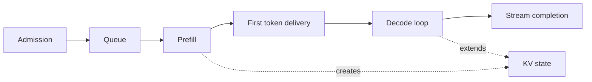

# What inference engineering controls

## Question

Which system decisions can change a request's user-visible outcome, and which measured boundary tells us whether they helped?

## Mental model

The request path is a chain of queues, serialized transitions, and resource decisions. A change at one level can move the bottleneck rather than remove it.

## Workload variables

- Arrival timing and burst size
- Input and output token-length distributions
- Model revision, precision, and eligible serving profiles
- Shared-prefix probability and priority mix
- TTFT, TPOT, completion, quality, cost, and reliability objectives

## Constrained resources and serialized stages

Admission capacity, queue space, prefill work, first-token delivery, decode iterations, KV capacity, and stream delivery can each constrain the request. A single utilization percentage does not identify which one is binding because it has no queue or phase boundary.

## Metrics and boundaries

Measure queue time from admission to engine start, TTFT from admission to first token available to the client, TPOT between output tokens, and completion from admission to the final token. Record cache lookup, allocation, transfer, and eviction as separate timings when they are on the request path.

## Control levers and preconditions

Admission limits require a stated overload behavior. Batching requires compatible requests and enough KV capacity. Prefix reuse requires an exact cache identity rule. Routing requires qualified serving profiles. Every lever needs a metric boundary that could show regression.

## Failure modes and counterexamples

Increasing a batch limit can improve aggregate output tokens while worsening TTFT. Adding replicas can leave the bottleneck unchanged when a shared queue or cache tier is serialized. Lowering average latency can still reduce goodput if more requests miss the tail objective.

## Worked numerical example

For an illustrative request, queue time is 3 ms, prefill is 11 ms, first-token delivery is 1 ms, and five later decode gaps are 4 ms each. TTFT is `3 + 11 + 1 = 15 ms`. Completion latency is `15 + 5 * 4 = 35 ms`. These are `estimated` arithmetic examples, not a measurement.

## Executable exercise

Run `ie validate experiment` to inspect a versioned `simulated` record. Identify the hypothesis, workload, environment, configuration, raw values, derived values, and limitations. Then decide which additional boundary would be needed to distinguish queue delay from prefill delay.

## Primary references

- [Attention Is All You Need, Vaswani et al.](https://arxiv.org/abs/1706.03762)
- [ORCA, Yu et al., OSDI 2022](https://www.usenix.org/conference/osdi22/presentation/yu)
- [Experiment-record format](../reference/experiment-record.md)
