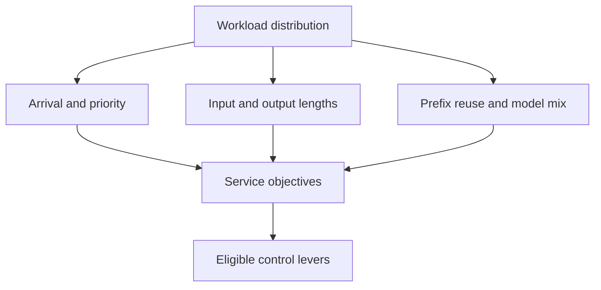

# Workloads, user experience, and service objectives

## Question

What must a workload description contain before two configurations can be compared honestly?

## Mental model

A workload is a distribution, not a single prompt or a peak token rate. It connects requests to objectives and determines whether a control lever is relevant.

## Workload variables

Use a schema with arrival distribution, input-length distribution, output-length distribution, shared-prefix distribution, models, priorities, and objectives. The [four synthetic archetypes](../reference/exercises.md#workload-archetypes) cover interactive chat, shared-prefix retrieval, long-context analysis, and mixed-priority batch work.

## Constrained resources and serialized stages

Short interactive requests often expose queue and first-token behavior. Long inputs amplify prefill work and KV residency. Long outputs amplify decode scheduling and KV growth. Shared prefixes make cache identity and capacity relevant. A mixed model set makes profile qualification and placement relevant.

## Metrics and boundaries

State percentile TTFT and TPOT objectives separately. Add completion, goodput, quality, cost per useful completion, and availability when they matter. Record each objective's population and time window. Do not substitute aggregate throughput for an objective that is defined per request.

## Control levers and preconditions

Priority queues require a defined fairness rule. Prefix caching requires a stable prefix key and invalidation behavior. Long-context admission requires a KV reservation rule. Multi-model routing requires measurements for every candidate serving profile under the relevant workload.

## Failure modes and counterexamples

The same configuration can rank differently. Suppose configuration A has a 2-unit hit path and a 10-unit miss path, so a hit saves 8 units relative to a miss; configuration B always performs 8 units of prefill. On a 90 percent reuse workload, A has expected work `0.9 * 2 + 0.1 * 10 = 2.8` units and wins. On zero reuse, A costs 10 units and B costs 8. These are `estimated` examples, not measurements.

## Worked numerical example

Describe a bursty workload as: arrivals at ticks 0 through 8, input lengths from 3 to 16 tokens, outputs from 4 to 14 tokens, two priority classes, one model, and no prefix reuse. That is the fully declared trace used by `ie simulate batching`; it is small enough to inspect and broad enough to expose queueing.

## Executable exercise

Read the workload archetypes in [Exercises](../reference/exercises.md#workload-archetypes). Pick one and define one TTFT objective, one TPOT objective, and one goodput criterion. Run `ie simulate batching` and explain why its fixed trace is not enough evidence for the selected archetype without further traces.

## Primary references

- [ORCA, Yu et al., OSDI 2022](https://www.usenix.org/conference/osdi22/presentation/yu)
- [DistServe, Zhong et al., OSDI 2024](https://www.usenix.org/system/files/osdi24-zhong-yinmin.pdf)
- [Benchmark checklist](../reference/benchmark-checklist.md)
