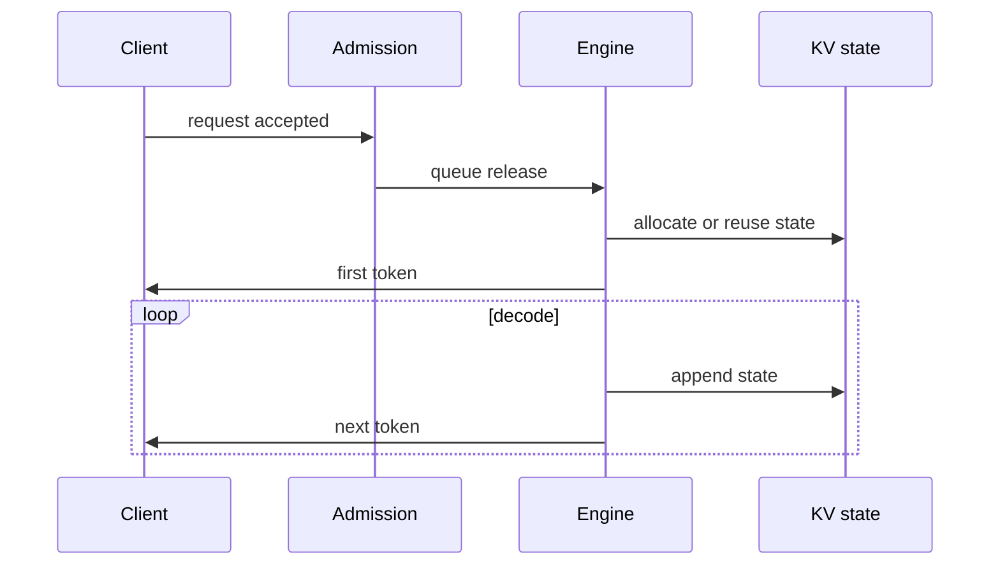

# Request lifecycle and metric boundaries

## Question

Where do TTFT, TPOT, and completion start and stop, and what observations separate their causes?

## Mental model

TTFT is not only prefill time. It includes every request-path stage from admission until the first token is available to the client. TPOT is a distribution of adjacent delivery gaps after that boundary.

## Workload variables

Arrival burstiness changes queue time. Input length changes prefill work. Output length changes the number of decode iterations. Reuse probability changes cache operations. Stream behavior and priority determine whether client delivery is itself observable.

## Constrained resources and serialized stages

Queue admission, cache lookup, KV allocation, prefill, decode scheduling, network transfer, and client stream flushes may serialize. The request lifecycle records each boundary so a later diagnosis does not treat all latency as engine time.

## Metrics and boundaries

Use these definitions:

| Metric | Start | Stop |
| --- | --- | --- |
| Queue time | Request admitted | Engine starts work |
| TTFT | Request admitted | First generated token is available to the client |
| ITL | One token available | Adjacent token available |
| TPOT | After first token | Mean or percentile of ITL over a declared population |
| Completion | Request admitted | Final token available to the client |

## Control levers and preconditions

Queue policy requires a way to attribute waiting. Chunked prefill requires phase-level timing. Disaggregation requires prefill completion and KV-transfer boundaries. Stream buffering changes client-visible TTFT and needs delivery instrumentation.

## Failure modes and counterexamples

An engine can report fast prefill while TTFT remains high because the request waited in admission. A low mean TPOT can hide a periodic stall. A high device utilization value can coexist with a cache-capacity admission failure. None of these observations alone identifies the bottleneck.

## Worked numerical example

Consider admission at tick 0, engine start at tick 4, first token at tick 10, later tokens at ticks 13, 17, and 20, and final completion at tick 20. Queue time is 4 ticks, TTFT is 10 ticks, ITL values are 3, 4, and 3 ticks, mean TPOT is `10 / 3` ticks, and completion is 20 ticks. These are `estimated` boundary calculations.

## Executable exercise

Run `ie simulate batching --strategy chunked`. For one request, compare `queue_ticks`, `ttft_ticks`, and `completion_latency_ticks`. Identify which field would change if only the admission policy changed, assuming engine work stayed constant.

## Primary references

- [Taming Throughput-Latency Tradeoff in LLM Inference with Sarathi-Serve](https://arxiv.org/abs/2403.02310)
- [DistServe, Zhong et al., OSDI 2024](https://www.usenix.org/system/files/osdi24-zhong-yinmin.pdf)
- [Glossary](../reference/glossary.md)
