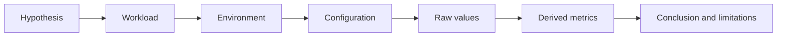

# Measurement integrity and experiment records

## Question

How can a result show what was observed without implying that a simulation, estimate, or paper statement was reproduced?

## Mental model

An experiment record is a reproducible argument. The conclusion is bounded by its evidence class, workload, environment, and declared assumptions.

## Workload variables

The record includes arrivals, input and output lengths, prefix reuse, model identity or synthetic shape, priorities, and objectives. A result without workload metadata cannot establish which condition it represents.

## Constrained resources and serialized stages

The record names the suspected constrained resource and the metrics that would contradict the hypothesis. Examples include queue capacity, prefill work, decode scheduling, KV capacity, transfer, or a control decision.

## Metrics and boundaries

Raw values are direct observations from the declared model or environment. Derived metrics apply a stated calculation to them. Every numeric result gets one evidence class: `measured`, `simulated`, `estimated`, or `reported`.

## Control levers and preconditions

An experiment may compare one lever only when its configuration, guardrails, workload, and environment are held or recorded. A measured result needs environment metadata. A simulated result needs model rules. An estimated result needs formulas. A reported result needs a primary source URL.

## Failure modes and counterexamples

Copying a paper number into a local table turns a `reported` value into an implied reproduction. Averaging only completed requests can hide admission failures. Comparing two runs with different prompt distributions may attribute a workload change to a runtime flag.

## Worked numerical example

If raw simulated completion times are 12, 16, 18, and 28 ticks, p95 with the nearest-rank rule is 28 ticks. The raw values and p95 are both `simulated`; the p95 is derived. The result says nothing about hardware because the environment is a declared abstract simulation.

## Executable exercise

Run `ie validate experiment` with no path, then run it against each file in `examples/experiments`. Change one value's `evidence` label in a temporary copy and confirm validation fails when it no longer matches the record result type.

## Primary references

- [Experiment-record format](../reference/experiment-record.md)
- [Benchmark checklist](../reference/benchmark-checklist.md)
- [Publication policy](../publication-policy.md)
