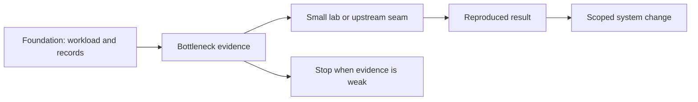

# Where inference engineering is going

## Question

Which next problems merit a separate experiment or repository, and what evidence gate should prevent premature specialization?

## Mental model

The path forward is evidence-driven specialization. New mechanisms belong in a separate lab when their policy surface or environment requirements would make this guide less readable and less deterministic.

## Current map, not a mechanism claim

[Towards Efficient Large Language Model Serving: A Survey on System-Aware KV Cache Optimization, arXiv:2607.08057](https://arxiv.org/abs/2607.08057) organizes recent KV work by execution and scheduling, placement and migration, and representation and retention. Use it as a future map for finding interactions to test. It is a survey, not evidence that any one mechanism applies to a local workload.

The [project opportunity map](../reference/project-opportunity-map.md) separates the existing P0 foundation from gated future work: diagnosis and KV-policy evidence must precede scheduler, placement, controller, and larger runtime projects.

## Workload variables

Long-context distributions, shared-prefix graphs, multi-model mixes, heterogeneous profiles, MoE routing, energy objectives, and topology become relevant only when a measured or well-bounded workload shows they matter.

## Constrained resources and serialized stages

Future work may expose kernel-level bandwidth, cluster KV movement, expert communication, profile placement, or control-loop delay. The bottleneck must be identified with a comparable baseline before creating a new mechanism.

## Metrics and boundaries

Retain the same boundary discipline: workload metadata, environment, raw observations, derived objective metrics, failure accounting, and evidence labels. A new research direction should state what result would disprove its motivating hypothesis.

## Control levers and preconditions

Kernel microbenchmarks need supported hardware and a controlled harness. A KV-fabric simulator needs a stable policy interface and trace vocabulary. Pooling experiments need qualified profiles. Adaptive methods need action bounds and a safe validation mode. Upstream work needs a bounded public integration seam.

## Failure modes and counterexamples

A paper mechanism may not address the measured bottleneck. A hardware-specific result may not generalize to another profile. A simulator can reveal a policy tradeoff without validating transfer latency. An upstream patch can be too large if its interface was not discussed first.

## Worked numerical example

Suppose a measured workload shows 70 percent of TTFT in queueing and 5 percent in a candidate attention operation. Even a hypothetical 100 percent improvement in that operation is bounded by 5 percent of TTFT. The `estimated` bound says to investigate admission or scheduling before a kernel project.

## Executable exercise

Choose one bounded question for [Inference Bottleneck Lab](https://github.com/santho090/inference-bottleneck-lab) or [KV Policy Lab](https://github.com/santho090/kv-policy-lab). Write an experiment record with a falsifiable hypothesis, a stop condition, and a result type. Validate it with `ie validate experiment` before proposing a P1 or P2 implementation.

## Primary references

- [Research map](../reference/research-map.md)
- [Runtime and project map](../reference/runtime-map.md)
- [Project opportunity map](../reference/project-opportunity-map.md)
- [Repository boundary](../adr/0001-repository-boundary.md)
