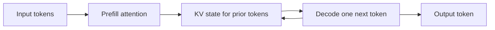

# Transformer inference anatomy

## Question

Why do prefill and decode create different resource pressure even for the same request?

## Mental model

Prefill processes a known input sequence and creates initial key-value state. Decode repeatedly reads retained state, produces one token, and extends that state. The phases share a model but differ in shape and scheduling pressure.

## Workload variables

Input length changes prefill work and initial KV size. Output length changes the number of serialized decode steps. Attention-head and key-value-head counts affect cache size. Prefix reuse can replace part of prefill with state lookup and attachment.

## Constrained resources and serialized stages

Prefill can expose compute, memory bandwidth, activation workspace, and launch behavior. Decode has an autoregressive dependency between output tokens and repeatedly reads growing KV state. The next token cannot be committed before the previous token is available.

## Metrics and boundaries

Measure prefill start and finish, first-token delivery, decode iteration duration, KV bytes per token, and cache hit or miss state. Use TTFT for the full admission-to-first-token path and TPOT or ITL for the later stream.

## Control levers and preconditions

Attention kernels require compatible layouts and precision. Grouped-query attention changes the model architecture and therefore must be known from its configuration. Prefix reuse requires exact prefix identity. Speculative decoding requires an acceptance procedure whose output semantics are validated.

## Failure modes and counterexamples

Treating decode as only a smaller prefill hides its growing KV read path and serial dependence. Treating all attention heads as KV heads overestimates cache memory for grouped-query architectures. A cache hit can reduce prefill work while adding transfer or placement work.

## Worked numerical example

For a 24-layer configuration with 8 key-value heads, head dimension 128, and 2-byte elements, one new token adds `24 * 8 * 128 * 2 * 2 = 98,304` bytes of K and V state per sequence. This is an `estimated` formula under dense storage assumptions.

## Executable exercise

Run `ie memory kv` and compare the output with `ie memory kv --kv-heads 32`. The latter removes grouped-query sharing. Explain why the ratio changes while output length and concurrency stay fixed.

## Primary references

- [Attention Is All You Need, Vaswani et al.](https://arxiv.org/abs/1706.03762)
- [GQA, Ainslie et al.](https://arxiv.org/abs/2305.13245)
- [KV-cache sizing](08-memory-sizing.md)
