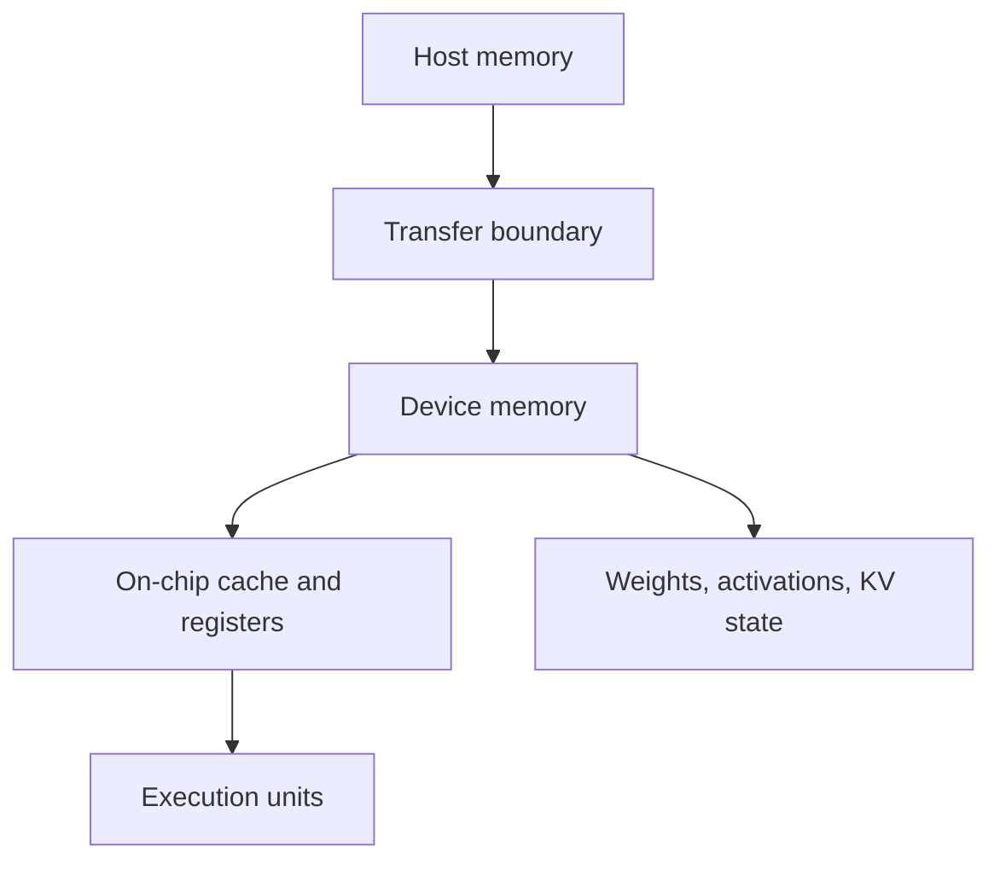

# GPU execution and the memory hierarchy

## Question

Which data movement or serialized execution stage should be measured before choosing a kernel or runtime optimization?

## Mental model

An operation's time is bounded by useful arithmetic, bytes moved through the relevant hierarchy, and serialized overhead. The hierarchy is a reasoning aid, not a substitute for a qualified measurement.

## Workload variables

Batch shape, token counts, sequence lengths, precision, model dimensions, parallelism, and active sequence count influence how much data is reused and how much state must be resident. A profile only applies when these inputs are compatible with its qualification.

## Constrained resources and serialized stages

Weights and KV state compete for device memory. Activations and temporary workspaces add working-set pressure. Transfers, kernel launches, synchronization, and collective communication can serialize otherwise parallel work. A capacity failure is distinct from a bandwidth limit.

## Metrics and boundaries

Record device memory reservation, live KV usage, allocation failures, transfer bytes and duration, kernel-duration distribution, launch gaps, and collective duration. Associate each observation with model revision, precision, parallelism, and workload shape.

## Control levers and preconditions

Precision changes require correctness and quality checks. Fusion requires compatible operation order and layouts. CUDA graph capture requires a stable execution shape. Parallelism requires a measured communication path. Pooling requires profiles with comparable units and known limits.

## Failure modes and counterexamples

More free device memory does not prove a request is bandwidth-bound. Higher nominal bandwidth does not help a launch-bound operation. A memory estimate can fit while the runtime fails because reservation granularity, workspaces, or fragmentation were omitted.

## Worked numerical example

Suppose a device has a 16 GiB capacity budget, estimated weights consume 10 GiB, KV reservations consume 4 GiB, and workspace plus allocator headroom is set to 3 GiB. The estimated total is 17 GiB, so the configuration should be rejected before benchmarking. The arithmetic is `estimated` and assumes the budget is valid for the profile.

## Executable exercise

Run `ie memory model` and `ie memory kv`. Add their byte totals and write down the unmodeled reservation categories that must be measured before deciding a profile has usable headroom.

## Primary references

- [Roofline model, Williams, Waterman, and Patterson](https://www2.eecs.berkeley.edu/Pubs/TechRpts/2008/EECS-2008-134.html)
- [FlashInfer documentation](https://docs.flashinfer.ai/)
- [Memory sizing](08-memory-sizing.md)
