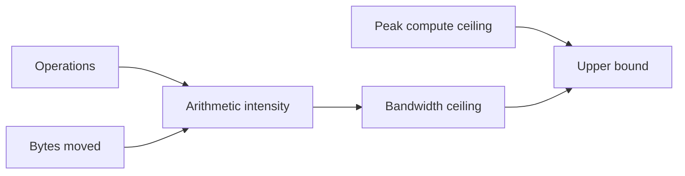

# Roofline reasoning and arithmetic intensity

## Question

Is an operation more plausibly constrained by compute or memory bandwidth under stated assumptions?

## Mental model

Arithmetic intensity is operations divided by bytes moved. The roofline upper bound is the lower of a compute ceiling and arithmetic intensity multiplied by bandwidth. It is a bound, not a throughput promise.

## Workload variables

Phase, input length, active sequence count, sequence length, precision, layout, and cache residency change operations and bytes moved. A prefill-shaped operation and a decode-shaped operation should not inherit one shared estimate.

## Constrained resources and serialized stages

The model selects an ideal compute or bandwidth ceiling. It does not model launch gaps, synchronization, cache misses, transfer overlap, queueing, allocator waits, or a contended shared resource. Those omissions are why a roofline result cannot diagnose the whole service.

## Metrics and boundaries

Collect operation count and bytes-moved assumptions, then identify the profile's qualified peak compute and bandwidth ceilings. Keep engine execution separate from queue, cache-transfer, and client-delivery time.

## Control levers and preconditions

If the bandwidth roof is lower, reduce bytes moved or improve reuse before chasing arithmetic changes. If the compute roof is lower, consider arithmetic efficiency, fusion, or a compatible kernel. Both paths require a measured profile because theoretical ceilings can be unreachable.

## Failure modes and counterexamples

Low arithmetic intensity does not prove a memory bottleneck when the operation is launch-bound. High arithmetic intensity does not prove compute saturation when a cache miss or transfer is serialized. A profile ceiling from one precision or layout does not apply to another.

## Worked numerical example

The checked-in prefill-shaped fixture uses 1,000,000,000 operations and 200,000,000 bytes, so intensity is 5 operations per byte. With a 2,000,000,000,000 operations-per-second compute ceiling and 1,000,000,000,000 bytes-per-second bandwidth ceiling, the bandwidth roof is 5,000,000,000,000 operations per second and the upper bound is 2,000,000,000,000. It is `estimated` from synthetic ceilings.

## Executable exercise

Run `ie roofline` and `ie roofline --scenario decode`. Compare the selected limiting resource. Then double `--bytes-moved` for the prefill scenario and predict whether the bound changes before running it.

## Primary references

- [Roofline model, Williams, Waterman, and Patterson](https://www2.eecs.berkeley.edu/Pubs/TechRpts/2008/EECS-2008-134.html)
- [Generated estimated result](../reference/generated-results.md#prefill-shaped-roofline-estimate-with-synthetic-device-ceilings)
- [Equations and notation](../reference/equations.md)
