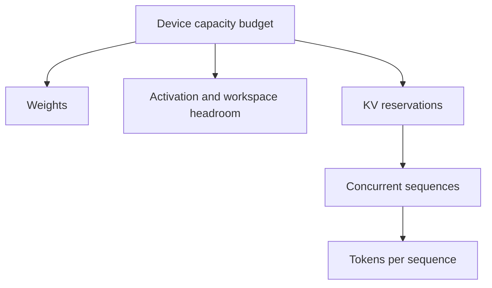

# Model weights, activations, and KV-cache sizing

## Question

Can a proposed concurrency and sequence-length configuration fit before any runtime experiment begins?

## Mental model

Weights are mostly persistent model state. Activation and workspace use depend on execution. KV state grows with tokens and active sequences. A fit calculation should name every omitted category rather than treating the result as a guarantee.

## Workload variables

Parameter count, precision, hidden size, layers, input and output lengths, concurrency, key-value head count, head dimension, reservation policy, and prefix reuse determine the estimate. GQA changes `kv_heads` without changing the number of query heads.

## Constrained resources and serialized stages

Device capacity and allocator granularity can reject an admission. KV allocation and reservation can fragment capacity. Cache eviction or transfer can add serialized work even when a static formula fits. Persistent weights constrain the remaining capacity available to transient state.

## Metrics and boundaries

Record configured capacity budget, weights, activation or workspace reservations, KV reserved blocks, used blocks, free blocks, eviction count, and allocation failures. Keep estimated bytes and runtime-reserved bytes as separate values.

## Control levers and preconditions

Lower precision requires a quality and correctness check. GQA is a model property, not a cache flag. Paging requires a block size and mapping policy. Admission control requires a reservation rule. Prefix sharing requires safe identity and reference ownership.

## Failure modes and counterexamples

Using attention-head count instead of key-value-head count can overestimate GQA cache memory. Ignoring block rounding can underestimate reservations. Counting free blocks without their spans can miss a contiguous-allocation failure. An estimate that fits leaves no proof about runtime workspace.

## Worked numerical example

The synthetic model fixture has 1,000,000,000 parameters at 2 bytes each, giving 2,000,000,000 bytes of weights. Its configured activation working set is 33,554,432 bytes. The total 2,033,554,432 bytes is `estimated`; it omits KV state, workspaces, allocator slack, and transfer copies. The GQA KV fixture estimates 98,304 bytes per token per sequence and 1,610,612,736 bytes for eight 2,048-token sequences.

## Executable exercise

Run `ie memory model` and `ie memory kv`. Then run `ie simulate kv --allocation contiguous` and `ie simulate kv --allocation paged`. Explain why total free blocks can be enough for paging yet insufficient for one contiguous reservation.

## Primary references

- [GQA, Ainslie et al.](https://arxiv.org/abs/2305.13245)
- [PagedAttention, Kwon et al.](https://arxiv.org/abs/2309.06180)
- [Generated estimated results](../reference/generated-results.md)
