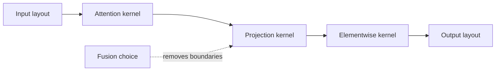

# Level 1: kernel optimization

## Question

Which operation, data layout, or launch boundary constrains one engine step after the workload and profile are fixed?

## Mental model

Level 1 changes the execution of a compatible operation. It does not fix queueing, cache admission, placement, or a workload mismatch. The useful question is which byte movement, arithmetic path, or launch boundary is actually constraining the selected phase.

## Workload variables

Token count per operation, batch shape, head dimension, attention layout, precision, sequence length, active sequences, and static versus varying shapes influence the kernel path. A kernel result without these inputs is not reusable evidence.

## Constrained resources and serialized stages

Relevant constraints include arithmetic throughput, memory bandwidth, cache reuse, register pressure, launch overhead, graph replay setup, and synchronization. Serialized launches can dominate small work even when an operation's roofline looks favorable.

## Metrics and boundaries

Measure phase-specific kernel duration, launch gap, bytes moved, achieved arithmetic intensity, synchronization delay, and correctness against an agreed reference. Record shape, layout, precision, runtime version, and qualified profile with each measurement.

## Control levers and preconditions

Fusion requires compatible dependencies and numerical behavior. Layout changes require downstream compatibility. CUDA graph replay requires stable shapes and safe capture boundaries. An attention backend requires the model architecture and cache layout it supports. Each change needs a correctness check before its timing is compared.

## Current mechanism to study

[FlashInfer, arXiv:2501.01005](https://arxiv.org/abs/2501.01005) is a Level 1 source because its serving attention interface makes batch metadata, paged-KV layout, and operation planning explicit. Its documented planning and execution boundary is useful for asking which shapes and layouts are stable enough to reuse. Treat any resulting observation as kernel-local until queueing, cache admission, and scheduler effects are measured at their own boundaries.

## Failure modes and counterexamples

Fusing two operations can reduce launches while increasing register pressure and lowering occupancy. A faster kernel for one head dimension can reject another. A graph-captured path can fail on variable batch shapes. A better kernel cannot reduce a queue that existed before engine execution.

## Worked numerical example

Suppose three serialized launches take estimated durations 5, 5, and 5 microseconds. A compatible fused path is estimated at 12 microseconds. The best possible saving is 3 microseconds, before accounting for any new synchronization or layout cost. If queue time is 40 microseconds, the expected TTFT change is bounded by the much larger queue component.

## Executable exercise

Run `ie roofline --scenario prefill`. Change `--operations` and `--bytes-moved` to represent an imagined fusion that removes half the bytes but leaves arithmetic unchanged. State whether the estimated roof changes and what a real measurement would still need to observe.

## Primary references

- [FlashInfer, arXiv:2501.01005](https://arxiv.org/abs/2501.01005) and [official documentation](https://docs.flashinfer.ai/)
- [FlashAttention](https://arxiv.org/abs/2205.14135)
- [Roofline model, Williams, Waterman, and Patterson](https://www2.eecs.berkeley.edu/Pubs/TechRpts/2008/EECS-2008-134.html)
