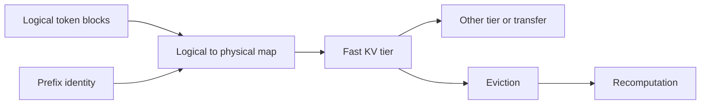

# Level 3: cache management

## Question

How should KV state be admitted, reserved, mapped, shared, evicted, moved, or recomputed without obscuring its cost?

## Mental model

KV policy is a group of decisions: admission, reservation, placement, sharing, movement, eviction, and recomputation. Calling all of them a cache algorithm hides the control boundary.

## Workload variables

Input and output length distributions, concurrency, prefix reuse, branch factor, priority, latency objective, transfer path, and model cache format determine cache pressure. A KV policy cannot be evaluated without both token shape and reuse shape.

## Constrained resources and serialized stages

Physical block capacity, allocation spans, allocator metadata, transfer bandwidth, cache lookup, eviction work, and recomputation can constrain requests. Logical state may fit in total free capacity yet fail one contiguous physical allocation because free blocks are fragmented.

## Metrics and boundaries

Record reserved, used, free, evicted, and recomputed blocks; logical-to-physical mappings; cache hit and miss counts; bytes moved; prefill tokens recomputed; allocation failure reason; and request TTFT or TPOT effects. Distinguish resident capacity from reusable prefix state.

## Control levers and preconditions

Paging needs a block size and mapping layer. Prefix reuse needs exact identity, ownership, lifetime, and reference rules. Reservation needs an upper-bound policy. Compression needs quality and kernel compatibility checks. Tiering and transfer need an observed transfer path and a fallback when the state is unavailable.

## Current mechanisms to study

[LMCache, arXiv:2510.09665](https://arxiv.org/abs/2510.09665) makes reuse, offload, and transfer visible through a cache layer and engine connector. [Mooncake, arXiv:2407.00079](https://arxiv.org/abs/2407.00079) treats KV state as a tiered resource in a disaggregated architecture. Both are Level 3 mechanisms when the question is identity, reservation, ownership, or local reuse. Their transfer paths also make them Level 5 sources.

A cache entry is not safely reusable merely because bytes are present. The experiment must establish compatible model and cache format, token identity, ownership, lifetime, location, and a fallback for a miss or invalid entry.

## Failure modes and counterexamples

Eviction may make admission succeed while moving latency into recomputation. Prefix reuse can be unsafe if identity is too broad. Reserving worst-case output for every request can lower fragmentation risk while unnecessarily reducing admission. Contiguous allocation can fail with enough total free blocks.

## Worked numerical example

The built-in trace uses ten physical blocks. After release events, a five-block request sees six free blocks distributed across spans of length two and four. It fails under contiguous allocation and succeeds under paging. The paged trace later evicts four blocks and recomputes two blocks. These are `simulated` allocator state transitions; they do not estimate transfer or compute time.

## Executable exercise

Run `ie simulate kv --allocation contiguous`, then `ie simulate kv --allocation paged`. Compare the `epsilon` event and final `reserved_blocks`, `used_blocks`, `free_blocks`, `evicted_blocks`, and `recomputed_blocks`. Explain which measurements a tiered cache would add.

## Primary references

- [PagedAttention, Kwon et al.](https://arxiv.org/abs/2309.06180)
- [vLLM documentation](https://docs.vllm.ai/)
- [Official SGLang documentation](https://docs.sglang.io/)
- [LMCache, arXiv:2510.09665](https://arxiv.org/abs/2510.09665) and [official public source](https://github.com/LMCache/LMCache)
- [Mooncake, arXiv:2407.00079](https://arxiv.org/abs/2407.00079)
