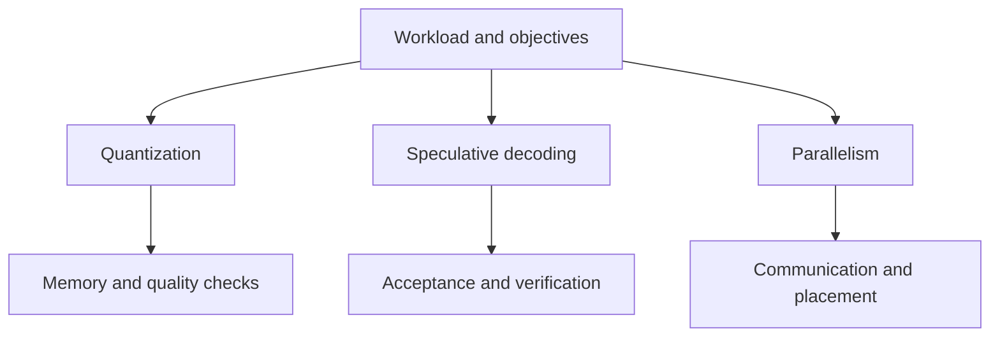

# Quantization, speculative decoding, and parallelism

## Question

Which runtime lever changes the constrained resource for this workload, and what new precondition or failure mode does it introduce?

## Mental model

These levers operate across the engine rather than replacing the six-level model. Each should be selected for a measured or estimated bottleneck and tested against a quality and latency objective.

## Workload variables

Precision tolerance, output distribution, draft acceptance behavior, input and output lengths, batch shape, model architecture, topology, and communication path determine whether a lever has a plausible benefit. The relevant variable is not a single global request rate.

## Constrained resources and serialized stages

Quantization can alter weight and KV residency, arithmetic paths, and conversion work. Speculative decoding can reduce serial target steps but adds drafting and verification. Tensor, pipeline, expert, and data parallelism can distribute compute while introducing collectives, pipeline bubbles, or placement constraints.

## Metrics and boundaries

Measure output quality with an agreed evaluation method, memory reservation, TTFT, TPOT, acceptance rate for speculative paths, target verification work, collective duration, transfer bytes, and tail completion. Label source-paper observations as `reported`, never as a local result.

## Control levers and preconditions

Quantization needs compatible kernels and a quality gate. Speculation needs a defined target distribution, draft path, acceptance procedure, and an observed acceptance rate. Parallelism needs a qualified topology, compatible partition, communication baseline, and failure behavior.

## Failure modes and counterexamples

Lower precision can fit more state but fail a quality objective. A draft path can add work when acceptance is poor. More parallel partitions can reduce per-device memory while increasing communication enough to worsen TPOT. A useful improvement at one batch size can fail under another workload shape.

## Worked numerical example

Assume an estimated 12 GiB weight residency at 2 bytes per parameter. A 1-byte representation would reduce that component to 6 GiB, saving 6 GiB before scale metadata, temporary conversions, and quality validation. The arithmetic is `estimated`; it does not establish an executable quantized path.

## Executable exercise

Run `ie memory model --weight-bytes 2` and `ie memory model --weight-bytes 1`. List the measurements that must accompany the smaller estimate before treating it as a serving-profile candidate. Then use `ie roofline --scenario decode` to explain why a memory saving does not automatically improve TPOT.

## Primary references

- [Fast Inference from Transformers via Speculative Decoding](https://arxiv.org/abs/2211.17192)
- [Accelerating Large Language Model Decoding with Speculative Sampling](https://arxiv.org/abs/2302.01318)
- [vLLM documentation](https://docs.vllm.ai/)
