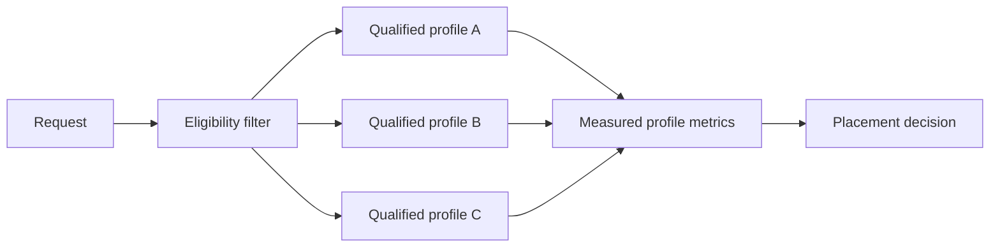

# Level 4: model and GPU pooling

## Question

How should a service assign a request to an eligible serving profile when models, memory limits, and accelerators differ?

## Mental model

A serving profile is a qualified combination of model revision, runtime, precision, parallelism, hardware, limits, and measured behavior. A pool is not uniform simply because each member has an accelerator.

## Workload variables

Model selection, input and output lengths, concurrency, prefix reuse, priority, quality requirement, latency objective, and allowed precision determine eligibility. Pool decisions need distributions, not only each profile's peak rate.

## Constrained resources and serialized stages

Weights, KV capacity, workspace, replica admission, queue isolation, model loading, and device fragmentation can constrain a pool. Placement persists longer than a single request; routing is the per-request selection among currently eligible endpoints.

## Metrics and boundaries

For each qualified profile, record model revision, runtime, precision, parallelism, capacity budget, admission failures, queue time, TTFT, TPOT, completion, quality result, and cost or energy boundary. Compare like objectives under the same workload slice.

## Control levers and preconditions

Pool membership requires a qualification result. Admission requires a per-profile memory and concurrency budget. Placement needs a drain or migration behavior. Routing needs eligibility, health, and objective-aware selection. Heterogeneous profiles need a stable unit for comparison, such as goodput under the same objective.

## Current mechanisms to study

[Aegaeon, DOI:10.1145/3731569.3764815](https://doi.org/10.1145/3731569.3764815) treats concurrent models as a pooled resource with fine-grained scaling decisions. [Prism, arXiv:2505.04021](https://arxiv.org/abs/2505.04021) studies elastic memory allocation for multi-model co-serving. [Coral, arXiv:2605.04357](https://arxiv.org/abs/2605.04357) jointly considers resource allocation and per-model serving strategy across heterogeneous replicas.

These are Level 4 sources because the governing question is profile eligibility and capacity sharing. Their control signals may later inform Level 6, but a pool experiment still needs a qualified profile boundary before it can rank or route requests.

## Failure modes and counterexamples

Round-robin can assign a long request to a profile without sufficient KV headroom. A lower-cost profile can lower goodput if it misses the tail objective. Treating two hardware types as interchangeable can hide a precision or parallelism incompatibility. Moving a resident request can add state-transfer cost that was not included in queue time.

## Worked numerical example

Profile A has an estimated 14 GiB capacity budget and reserves 11 GiB for weights plus workspace, leaving 3 GiB for KV. Profile B reserves 9 GiB and leaves 5 GiB. A request with an estimated 4 GiB KV reservation is ineligible for A and eligible for B before either profile is compared on latency. This is an `estimated` admission check, not a placement recommendation.

## Executable exercise

Use `ie memory model` and `ie memory kv` to define a proposed profile budget. Create an experiment record whose hypothesis says which profile is eligible and why. Run `ie validate experiment` on the record before treating the estimate as a runtime result.

## Primary references

- [vLLM documentation](https://docs.vllm.ai/)
- [SGLang documentation](https://docs.sglang.io/)
- [Aegaeon, DOI:10.1145/3731569.3764815](https://doi.org/10.1145/3731569.3764815)
- [Prism, arXiv:2505.04021](https://arxiv.org/abs/2505.04021)
- [Coral, arXiv:2605.04357](https://arxiv.org/abs/2605.04357)
- [Runtime and project map](../reference/runtime-map.md)
