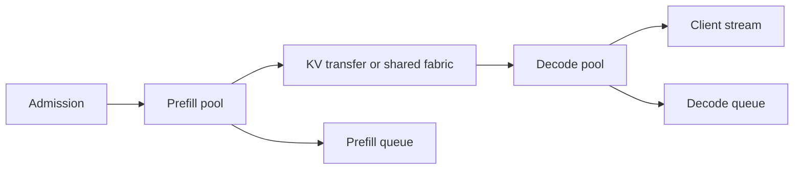

# Level 5: cluster architecture

## Question

When does phase separation or distributed state movement improve a service objective enough to justify its transfer and coordination costs?

## Mental model

Disaggregation assigns prefill and decode or state-management responsibilities to separate pools. It can reduce phase interference and permit independent profiles, but it adds a handoff boundary that must be measured.

## Workload variables

Input and output length mix, concurrent requests, prefix reuse, state size, output streaming objective, arrival burstiness, topology, model architecture, and expert-routing pattern determine whether separation has a plausible benefit.

## Constrained resources and serialized stages

Prefill capacity, decode capacity, KV transfer bandwidth and latency, fabric queueing, state serialization, placement affinity, and expert communication can constrain the architecture. A faster prefill pool does not help if its KV output waits for a saturated decode pool.

## Metrics and boundaries

Measure prefill queue and execution, KV bytes transferred, transfer start and finish, decode queue and execution, client TTFT and TPOT, state-transfer failures, and goodput. For expert placement, measure token-to-expert assignment, communication volume, imbalance, and the request-facing latency effect.

## Control levers and preconditions

Disaggregation requires compatible KV formats, a validated handoff protocol, state ownership, retry behavior, and capacity ratios. KV fabric design requires location, movement, admission, and eviction policies. Expert placement requires a model-compatible partition and a measured communication path.

## Current mechanisms to study

[LMCache, arXiv:2510.09665](https://arxiv.org/abs/2510.09665) and [Mooncake, arXiv:2407.00079](https://arxiv.org/abs/2407.00079) connect local KV policy to offload and state movement. [SmartGen, arXiv:2607.28150](https://arxiv.org/abs/2607.28150) studies selective KV transfer across the prefill/decode handoff. [Towards Load-Aware Prefill Deflection, arXiv:2607.02043](https://arxiv.org/abs/2607.02043) instead considers running bounded prefill work on a decode node when avoiding the handoff protects a stated objective.

These sources do not remove the handoff contract. Record format, token identity, state ownership, transfer completion, retry, fallback, and request-facing token delay separately. A faster transfer path is not enough if it obscures an invalid cache or shifts queueing to a different pool.

## Failure modes and counterexamples

Separating phases can add transfer delay that exceeds removed interference. Independent autoscaling can create a full prefill queue feeding an empty decode pool or the reverse. A cache transfer retry can duplicate state without idempotency. Expert locality can reduce network traffic while creating load imbalance.

## Worked numerical example

Assume a colocated engine has a 7 ms interference cost on a prefill-decode overlap. A proposed separated path removes that cost but adds estimated 3 ms transfer and 2 ms decode-pool queueing. The estimated net change is `-7 + 3 + 2 = -2 ms` only if the transfer and queue estimates hold. A 10 ms queue spike reverses the outcome.

## Executable exercise

Run `ie simulate batching` to identify the abstract phase-interference fields. Draft a measurement plan that adds four real boundaries: prefill completion, state-transfer start, state-transfer finish, and decode start. Record them as raw measurements in an experiment record.

## Primary references

- [DistServe, Zhong et al., OSDI 2024](https://www.usenix.org/system/files/osdi24-zhong-yinmin.pdf)
- [LMCache, arXiv:2510.09665](https://arxiv.org/abs/2510.09665)
- [Mooncake, arXiv:2407.00079](https://arxiv.org/abs/2407.00079)
- [SmartGen, arXiv:2607.28150](https://arxiv.org/abs/2607.28150)
- [Towards Load-Aware Prefill Deflection, arXiv:2607.02043](https://arxiv.org/abs/2607.02043)
- [llm-d official project](https://github.com/llm-d/llm-d)
- [Runtime and project map](../reference/runtime-map.md)
