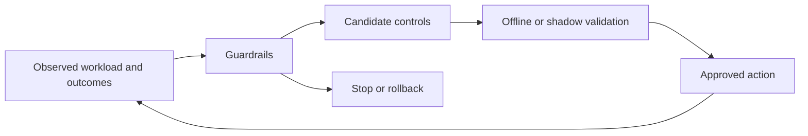

# Level 6: adaptive control

## Question

How can a controller change a bounded lever while preserving service objectives and avoiding unconstrained flag search?

## Mental model

Adaptive control is a constrained feedback loop. It predicts or observes workload state, proposes only eligible actions, validates them against guardrails, and retains a stop or rollback path.

## Workload variables

Recent arrival rate, prompt and output shape, priority mix, prefix reuse, model mix, queue state, quality signals, and profile availability can be inputs. The controller should state which variables are observed, estimated, delayed, or unavailable.

## Constrained resources and serialized stages

The controller is constrained by decision latency, measurement delay, policy safety, profile capacity, cache state, and action reversibility. It cannot repair a missing measurement boundary. Routing, batch budgets, admission limits, and placement are distinct levers with different persistence.

## Metrics and boundaries

Measure objective compliance, goodput, action frequency, prediction error, constraint violations, time spent in fallback, and the outcome relative to a stable baseline. Separate exploration cost from workload changes. Record the action and evidence that permitted it.

## Control levers and preconditions

An adaptive controller needs an explicit action set, bounds, objective, forbidden actions, confidence rule, cooldown, rollback, and human review condition. Search methods such as Bayesian optimization are useful only within a safe offline or shadow-validation boundary.

## Failure modes and counterexamples

Optimizing average throughput can violate tail TTFT. A delayed signal can apply yesterday's policy to a new burst. A controller can mistake a cache warm-up for a good configuration. Changing multiple levers at once removes causal attribution. A non-reversible action requires a stronger gate than a temporary queue limit.

## Worked numerical example

Assume a controller may select only batch budgets 16, 24, or 32 and must keep p95 TTFT below 40 ms. A candidate predicts 5 percent more throughput at budget 32 but its validation record has p95 TTFT of 43 ms. The candidate is rejected even if the throughput estimate is favorable. This is a policy example, not a measured controller result.

## Executable exercise

Use `ie validate experiment` as a gate for a proposed control action. Include the baseline, action bound, workload, safety constraint, observed result type, and rollback condition. Explain why a record without a tail metric cannot validate the example policy.

## Primary references

- [Practical Bayesian Optimization of Machine Learning Algorithms](https://arxiv.org/abs/1206.2944)
- [DistServe, Zhong et al., OSDI 2024](https://www.usenix.org/system/files/osdi24-zhong-yinmin.pdf)
- [Experiment-record format](../reference/experiment-record.md)
