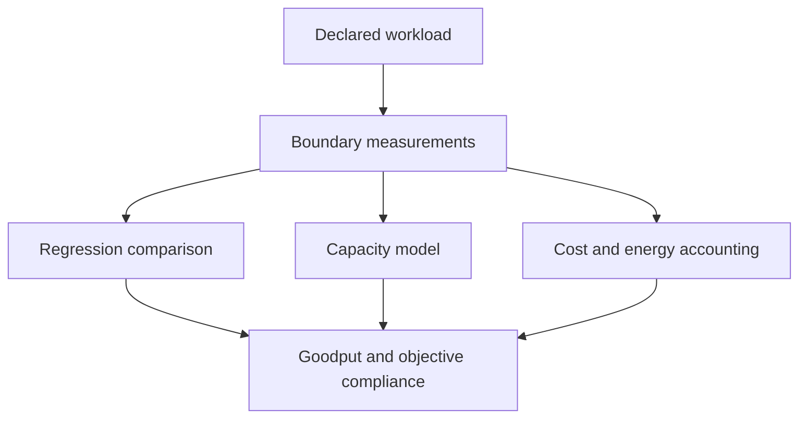

# Observability, regression testing, capacity planning, cost, and energy

## Question

What evidence is needed to identify regressions, plan capacity, and compare cost or energy without collapsing distinct objectives into one rate?

## Mental model

Observability records what happened at a defined boundary. Regression testing compares equivalent workloads and environments. Capacity planning uses a workload distribution and headroom policy. Cost and energy are denominators for useful work, not decorations on raw throughput.

## Workload variables

Arrival percentiles, burst duration, input and output lengths, reuse, model mix, priority, objective distribution, quality mix, and seasonality affect capacity. Regression fixtures must fix or explicitly vary these variables.

## Constrained resources and serialized stages

Queue capacity, profile capacity, KV capacity, transfer path, device time, control-plane action delay, and recovery capacity can constrain useful completion. Cost and energy accounting must identify the same period and resource boundary as the goodput numerator.

## Metrics and boundaries

Use attempted, admitted, completed, failed, and objective-satisfying request counts. Measure TTFT, TPOT, completion, cache effects, queueing, profile occupancy, allocation failures, and recovery duration. Express cost and energy per useful completion only after defining the denominator.

## Control levers and preconditions

Regression alarms require a baseline, tolerance, comparable environment, and failure accounting. Capacity plans require a demand distribution and headroom assumption. Cost controls require an action that preserves quality and reliability objectives. Energy controls require supported hardware instrumentation and a recorded sampling boundary.

## Failure modes and counterexamples

Comparing only successful requests can make a regression look like an improvement. A capacity plan based on mean arrivals can fail under bursty arrivals. Lower cost per raw token can reduce goodput if a service objective is missed. Energy samples without a workload denominator cannot compare configurations.

## Worked numerical example

In a 10-minute window, 1,000 requests are attempted, 950 complete, and 855 meet all objectives. Completion rate is 95 percent, while goodput fraction is 85.5 percent. If the resource cost for that window is 171 units, cost per useful completion is `171 / 855 = 0.2` units. These are `estimated` accounting examples.

## Executable exercise

Run `ie simulate batching` and calculate the goodput fraction from `completed_requests` and your chosen count of objective-satisfying requests. Then describe the raw measurements that would be required to turn this accounting exercise into a measured capacity comparison.

## Primary references

- [Benchmark checklist](../reference/benchmark-checklist.md)
- [Experiment-record format](../reference/experiment-record.md)
- [ORCA, Yu et al., OSDI 2022](https://www.usenix.org/conference/osdi22/presentation/yu)
